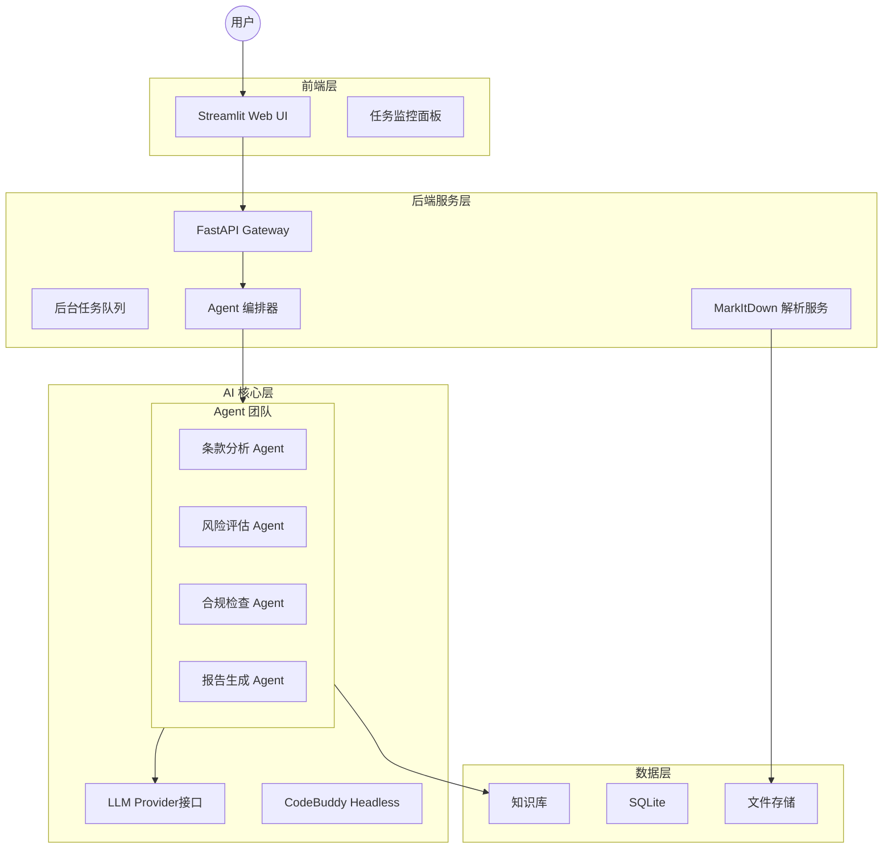

# 系统架构文档 (Architecture Design)

## 1. 整体架构概览

智能合同评审系统采用微服务分层架构，核心驱动力来自 **Multi-Agent（多智能体）** 协作系统。



## 2. 核心组件说明

### 2.1 Agent 编排器 (Orchestrator)

负责协调多个 AI Agent 的工作流程：

1. **任务分解**: 将合同评审任务分解为多个子任务
2. **Agent 调度**: 按依赖关系调度不同 Agent
3. **结果聚合**: 收集各 Agent 输出并整合
4. **状态管理**: 跟踪评审进度和状态

### 2.2 AI Agent 团队

| Agent | 职责 | 输入 | 输出 |
|-------|------|------|------|
| 条款分析 Agent | 解析合同结构和条款 | 合同文本 | 条款列表、结构分析 |
| 风险评估 Agent | 识别潜在风险点 | 条款列表、风险矩阵 | 风险评估报告 |
| 合规检查 Agent | 检查合规性问题 | 条款列表、Checklist | 合规检查报告 |
| 报告生成 Agent | 生成最终评审报告 | 各Agent输出 | 综合评审报告 |

### 2.3 知识库系统

支持多种知识库类型：

- **Checklist**: 评审检查清单，确保评审完整性
- **风险矩阵**: 风险等级评估标准
- **SOP**: 标准操作流程指南

## 3. 数据流

```
用户上传合同
    ↓
MarkItDown 解析 → 结构化文本
    ↓
条款分析 Agent → 条款列表
    ↓
┌─────────────────┬─────────────────┐
│                 │                 │
↓                 ↓                 
风险评估 Agent    合规检查 Agent
│                 │
└────────┬────────┘
         ↓
    报告生成 Agent
         ↓
    评审报告输出
```

## 4. 技术选型

| 组件 | 技术 | 说明 |
|------|------|------|
| Web 框架 | FastAPI | 高性能异步框架 |
| 前端 | Streamlit | 快速构建数据应用 |
| 文档解析 | MarkItDown | 微软开源，支持多格式 |
| LLM | OpenAI API 兼容 | 支持多种 LLM 提供商 |
| 数据库 | SQLite | 轻量级任务历史存储 |

## 5. 扩展性设计

- **Agent 可插拔**: 支持添加新的专业 Agent
- **知识库可配置**: 支持自定义知识库
- **LLM 可切换**: 支持多种 LLM 提供商
- **报告模板化**: 支持自定义报告模板
