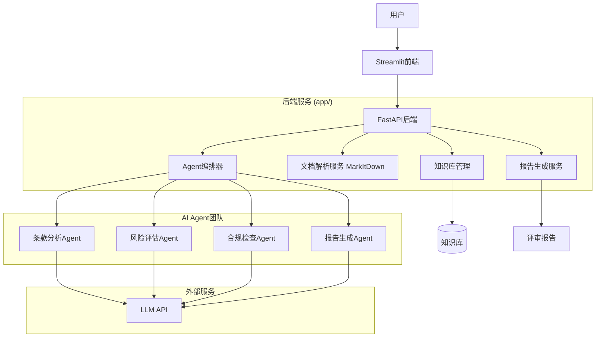

# 端到端合同评审AI系统方案

## 1. 方案概述

本项目提供一个完整的、端到端的合同评审AI系统。系统采用微服务架构，前端使用Streamlit提供用户交互界面，后端基于FastAPI构建，核心评审逻辑由多Agent协作系统驱动。

本方案支持标准的OpenAI兼容API（支持接入OpenAI、DeepSeek、Qwen等模型服务）或内置的Mock模式进行独立运行。

## 2. 系统架构



## 3. 核心功能

### 3.1 文档解析
- 支持 PDF、Word、Excel、PowerPoint 等多种格式
- 使用 MarkItDown 进行结构化解析
- 自动提取合同关键信息

### 3.2 多Agent协作评审
- **条款分析Agent**: 解析合同结构，提取关键条款
- **风险评估Agent**: 基于风险矩阵识别风险点
- **合规检查Agent**: 对照Checklist检查合规性
- **报告生成Agent**: 整合各Agent输出，生成专业报告

### 3.3 知识库驱动
- Checklist: 评审检查清单
- 风险矩阵: 风险等级评估标准
- SOP: 标准操作流程

### 3.4 报告生成
- Markdown 决策摘要
- HTML 交互式报告
- Excel 综合报表

## 4. 部署方式

### 4.1 本地部署

```bash
# 安装依赖
pip install -r requirements.txt

# 配置环境变量
cp .env.example .env
# 编辑 .env 配置 LLM API

# 启动服务
start_services.bat  # Windows
# 或手动启动
python -m uvicorn app.main:app --port 8000
python -m streamlit run app/frontend.py --server.port 8501
```

### 4.2 Docker 部署（待实现）

```bash
docker-compose up -d
```

## 5. 使用流程

1. 访问 http://localhost:8501
2. 上传合同文件
3. 选择知识库
4. 点击"开始评审"
5. 查看实时进度
6. 下载评审报告

## 6. 技术栈

| 组件 | 技术 |
|------|------|
| 后端框架 | FastAPI |
| 前端框架 | Streamlit |
| 文档解析 | MarkItDown |
| LLM | OpenAI 兼容 API |
| 数据库 | SQLite |
| 语言 | Python 3.10+ |
