# 🤖 ��评审AI系统 (Contract Review AI)

基� **CodeBuddy Headless** + **MarkItDown** + **Multi-Agent�作** 的智能��评审系�


## 📋 项目简�
本项目是一个�业级智能��评审系统，采�**Multi-Agent（多智能体）** �作��，能够模拟真�法务团队的评审�程。它能自动解�多�格�的��文件，并基�专业知识库（Checklist�SOP��险矩阵）进行全�评审，最终生�结�化�多维度的专业评审报告�
### �核心特�
- 🤖 **多Agent�作**: 4个专业AI Agent（�款分���险评估��规检查�首席评审）��工作
- 📄 **多格�文件解�*: 支�PDF�Word�Excel�PowerPoint�图片�ZIP�0+�格�- � **知识库驱�*: 深度集�ContractCopilot的专业知识库（Checklist��险矩阵�SOP�- 📊 **专业报告**: 生�Markdown决策摘��HTML交互报告�Excel综�报表等多�格�- �**快速评�*: 5-10分钟��完�人工需�数�时的全�评审工�- 🖥�**�视化监�*: �时监�Agent团队的工作进度和状�
## ��系统��

### 多Agent�作�程

```mermaid
graph TD
    User[用户上传��] --> Parser[MarkItDown解�]
    Parser --> Orchestrator[Agent编�器]
    
    subgraph AgentTeam [AI Agent团队]
        Orchestrator --> Clause[� �款分�Agent]
        
        Clause --> Risk[🛡��险评估Agent]
        Clause --> Compliance[��规检查Agent]
        
        Risk --> Report[👨�⚖�报告生�Agent]
        Compliance --> Report
    end
    
    Report --> FinalReport[生�多格�报告]
```



### 技术栈

| 模� | 技�| 说� |
|------|------|------|
| **�端** | Streamlit | Python�生Web框�，�供�视化界� |
| **�端** | FastAPI | 高性能异步API�务，处�任务调�|
| **AI核心** | CodeBuddy Headless | 驱动Agent��和工具调�|
| **Agent框�** | 自研Agent Framework | 定义Agent基类�工具和编�逻辑 |
| **文档解�** | MarkItDown | 微软开�文档解�工具，支�多模�|

## 🤖 Agent团队介�

我们的系统由4个拥有特定角色和能力的AI Agent组��
### 1. � �款分�专家 (ClauseAnalysisAgent)
- **�责**: 分����款，��关键信�，检查完整�- **能力**: 基本信����关键�款识别��款完整性检�- **知识�*: 主��评审checklist.csv

### 2. 🛡��险评估专家 (RiskAssessmentAgent)
- **�责**: 识别并�化评估��- **能力**: �险识别��险�化（���）��供应对建�- **知识�*: �险矩阵.csv

### 3. ��规检查专�(ComplianceCheckAgent)
- **�责**: 检查���规�- **能力**: SOP�程检查�法律�规检查�公�政策�规检�- **知识�*: �交付评审SOP�程说�.csv

### 4. 👨�⚖�首席评审�(ReportGenerationAgent)
- **�责**: 综��方��，生�最终评审报�- **能力**: 结�整��决策生��报告撰�- **输出**: 决策建议�核心�险点�修改建议清�
## 🚀 快速开�
### 1. �境�求
- Python >= 3.10
- CodeBuddy CLI 已安装并�置

### 2. 安装�赖
```bash
# 克隆项目
git clone [repository-url]
cd contract-review-ai

# 创建虚拟�境
python -m venv venv
# Windows
venv\Scripts\activate
# Linux/Mac
source venv/bin/activate

# 安装�赖
pip install -r requirements.txt
```

### 3. 准备知识�确� `知识�` 目录下包�以下文件（�ContractCopilot�移）：
- `主��评审checklist.csv`
- `�险矩阵.csv`
- `�交付评审SOP�程说�.csv`

### 4. �动�务

**步骤 1: �动 CodeBuddy Headless**
```bash
codebuddy --serve --port 3000
```

**步骤 2: �动 FastAPI �端**
```bash
uvicorn app.main:app --host 0.0.0.0 --port 8000 --reload
```

**步骤 3: �动 Streamlit �端**
```bash
streamlit run app/frontend.py
```

### 5. 访问系统
- **Web界�**: http://localhost:8501
- **API文档**: http://localhost:8000/docs

## 🧪 测试�开�
### �行Agent测试
我们�供了一个独立的测试脚本�验�Agent工作�：

```bash
# �使没有�动CodeBuddy�务，该脚本也会自动切�到Mock模�进行演示
python test_agents.py
```

### �行�元测试
```bash
pytest tests/
```

## 📂 项目结�

```
contract-review-ai/
├── app/
�  ├── agents/                 # Agent��
�  �  ├── base_agent.py       # Agent基类
�  �  ├── clause_analysis_agent.py
�  �  ├── risk_assessment_agent.py
�  �  ├── compliance_check_agent.py
�  �  ├── report_generation_agent.py
�  �  └── tools/              # Agent工具��  ├── services/
�  �  ├── agent_orchestrator.py # Agent编���  �  ├── codebuddy_client.py   # CodeBuddy客户��  �  └── ...
�  ├── main.py                 # FastAPI�端
�  └── frontend.py             # Streamlit�端
├── config/                     # �置文件
├── data/                       # 数�存储
├── 知识�                      # 知识库文�└── tests/                      # 测试代�
```

## 📄 许��
MIT License

## 👥 作�
CFP学习项目 - Task07 毕业项目
