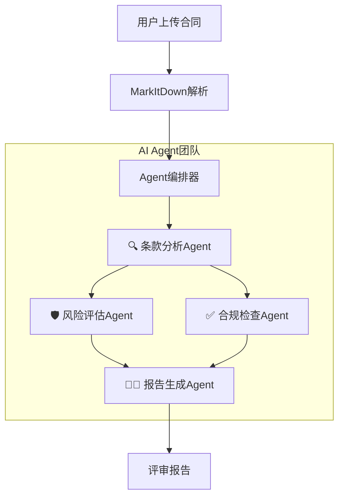

# 🤖 合同评审AI系统 (Contract Review AI)

基于 **CodeBuddy Headless** + **MarkItDown** + **Multi-Agent协作** 的智能合同评审系统


## 📋 项目简介

本项目是一个企业级智能合同评审系统，采用 **Multi-Agent（多智能体）** 协作架构，能够模拟真实法务团队的评审流程。它能自动解析多种格式的合同文件，并基于专业知识库（Checklist、SOP、风险矩阵）进行全面评审，最终生成结构化、多维度的专业评审报告。

### ✅ 核心特性

- 🤖 **多Agent协作**: 4个专业AI Agent（条款分析、风险评估、合规检查、首席评审）协同工作
- 📄 **多格式文件解析**: 支持PDF、Word、Excel、PowerPoint、图片、ZIP等10+种格式
- 🎯 **知识库驱动**: 深度集成ContractCopilot的专业知识库（Checklist、风险矩阵、SOP）
- 📊 **专业报告**: 生成Markdown决策摘要、HTML交互报告、Excel综合报表等多种格式
- ⚡ **快速评审**: 5-10分钟即可完成人工需要数小时的全面评审工作
- 🖥️ **可视化监控**: 实时监控Agent团队的工作进度和状态

## 🏗️ 系统架构

### 多Agent协作流程



## 🚀 快速开始

### 1. 环境准备

```bash
# 克隆项目
git clone https://github.com/yourusername/contract-review-ai.git
cd contract-review-ai

# 创建虚拟环境
python -m venv venv
source venv/bin/activate  # Linux/Mac
# 或 venv\Scripts\activate  # Windows

# 安装依赖
pip install -r requirements.txt
```

### 2. 配置环境变量

复制 `.env.example` 为 `.env` 并配置：

```bash
cp .env.example .env
```

编辑 `.env` 文件，配置 LLM API：

```env
# LLM 配置
LLM_PROVIDER=siliconflow
LLM_API_KEY=your_api_key_here
LLM_MODEL=deepseek-ai/DeepSeek-V3
LLM_BASE_URL=https://api.siliconflow.cn/v1
```

### 3. 准备知识库

将知识库文件放入 `知识库/` 目录：
- `checklist_*.csv` - 评审检查清单
- `风险矩阵_*.csv` - 风险评估矩阵
- `SOP_*.csv` - 标准操作流程

### 4. 启动服务

```bash
# Windows 用户
start_services.bat

# 或手动启动
python -m uvicorn app.main:app --port 8000  # 后端
python -m streamlit run app/frontend.py --server.port 8501  # 前端
```

### 5. 访问系统

- **Streamlit 前端**: http://localhost:8501
- **API 文档**: http://localhost:8000/docs

## 📁 项目结构

```
contract-review-ai/
├── app/
│   ├── agents/           # AI Agent 实现
│   │   ├── base_agent.py
│   │   ├── clause_analyzer.py
│   │   ├── risk_assessor.py
│   │   ├── compliance_checker.py
│   │   └── report_generator.py
│   ├── services/         # 核心服务
│   │   ├── parser.py     # 文档解析
│   │   ├── knowledge_base.py
│   │   └── orchestrator.py
│   ├── frontend.py       # Streamlit 前端
│   ├── main.py          # FastAPI 入口
│   └── config.py        # 配置管理
├── 知识库/               # 知识库文件（需自行配置）
├── data/
│   ├── uploads/         # 上传文件
│   └── outputs/         # 输出报告
├── requirements.txt
├── .env.example
└── README.md
```

## 🔧 技术栈

- **后端**: FastAPI + Python 3.10+
- **前端**: Streamlit
- **文档解析**: MarkItDown
- **LLM**: OpenAI 兼容 API（支持 DeepSeek、SiliconFlow 等）
- **数据存储**: SQLite（任务历史）

## 📝 使用说明

1. **上传合同**: 在前端界面上传合同文件（支持 PDF、Word、Excel 等）
2. **选择知识库**: 选择适用的评审知识库
3. **开始评审**: 点击开始，系统自动进行多Agent协作评审
4. **查看报告**: 评审完成后下载专业评审报告

## ⚠️ 注意事项

- API Key 等敏感信息请配置在 `.env` 文件中，不要提交到代码库
- 知识库文件包含业务敏感数据，需自行配置
- 建议在生产环境使用时配置适当的访问控制

## 📄 许可证

MIT License

## 🙏 致谢

- [MarkItDown](https://github.com/microsoft/markitdown) - 微软文档解析库
- [FastAPI](https://fastapi.tiangolo.com/) - 现代 Python Web 框架
- [Streamlit](https://streamlit.io/) - 数据应用框架
