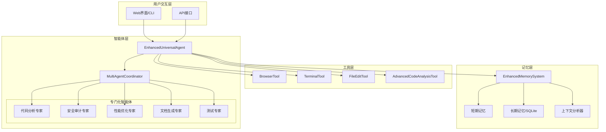

# UniversalAgent - 增强版通用智能体系统

> 基于Hello-Agents框架的企业级智能助手，支持多智能体协作、智能记忆和高级代码分析

## 📝 项目简介

这是一个基于 **Hello-Agents** 框架的增强版通用智能体系统，采用 **多智能体协作 + 智能记忆 + 高级分析** 设计。
系统通过协调多个专门化智能体协作处理复杂任务，并具备持久化记忆能力。

### 🎯 核心能力

| 能力 | 基础版 | 增强版 | 说明 |
|------|--------|--------|------|
| 智能网络搜索 | ✅ | ✅ | 多引擎搜索和内容提取 |
| 安全终端执行 | ✅ | ✅ | 20+种安全命令 |
| 文件操作 | ✅ | ✅ | 创建和编辑文件 |
| **多智能体协作** | ❌ | ✅ | 5种专门化智能体 |
| **智能记忆系统** | ❌ | ✅ | 持久化上下文记忆 |
| **高级代码分析** | ❌ | ✅ | 5维度代码质量检查 |
| **工作流编排** | ❌ | ✅ | 复杂任务自动编排 |

## 🏗️ 系统架构



## 🚀 快速开始

### 环境要求

- Python 3.10+
- 其他依赖见 requirements.txt

### 安装依赖

```bash
pip install -r requirements.txt
```

### 配置API密钥

```bash
# 创建.env文件
cp .env.example .env

# 编辑.env文件，填入你的API密钥
LLM_API_KEY=your_api_key_here
```

### 运行项目

**方式1: 增强版Web界面（推荐）**
```bash
python app_enhanced.py
# 访问 http://localhost:7860
```

**方式2: 基础版Web界面**
```bash
python app.py
```

**方式3: 命令行界面**
```bash
python main.py
```

**方式4: 运行示例**
```bash
python examples/demo_enhanced.py
```

## 📖 使用示例

### 1. 基础功能

```python
from src.agents import create_enhanced_agent

# 创建增强版智能体
agent = create_enhanced_agent()

# 智能对话
response = agent.run("帮我搜索Python最佳实践")
print(response)

# 执行终端命令
response = agent.run("查看当前目录的文件")
print(response)
```

### 2. 代码分析

```python
from src.agents import quick_analyze

# 快速分析代码
code = '''
def get_user(user_id):
    query = f"SELECT * FROM users WHERE id = {user_id}"
    cursor.execute(query)
    return cursor.fetchone()
'''

result = quick_analyze(code)
print(result)
```

**输出示例：**
```
============================================================
代码分析报告
============================================================
📊 质量评分: 60.0/100 (等级: D)
📝 总问题数: 2
   - 严重: 1
   - 错误: 0
   - 警告: 1

🔍 问题详情:
  [SECURITY]
    🔴 行 2: SQL注入风险：使用f-string构建SQL
       💡 建议: 使用参数化查询而不是f-string
```

### 3. 多智能体协作

```python
from src.agents import (
    MultiAgentCoordinator,
    AgentFactory,
    TaskRequest,
    AgentCapability,
    WorkflowTemplates
)

# 创建协调器并注册智能体
coordinator = MultiAgentCoordinator()
for agent in AgentFactory.create_all():
    coordinator.register_agent(agent)

# 执行代码审查工作流
tasks = WorkflowTemplates.code_review_workflow("path/to/code.py")
results = coordinator.execute_workflow(tasks)

# 查看结果
for task_id, response in results.items():
    print(f"任务 {task_id}: {response.status.value}")
```

### 4. 智能记忆

```python
from src.memory import EnhancedMemorySystem, MemoryType, ImportanceLevel

# 创建记忆系统
memory = EnhancedMemorySystem()
memory.start_session(user_id="user123")

# 添加交互
memory.add_interaction("user", "如何优化Python性能？")
memory.add_interaction("assistant", "可以使用列表推导式、避免全局变量...")

# 添加重要记忆
memory.add_memory(
    content="用户对Python性能优化感兴趣",
    memory_type=MemoryType.SEMANTIC,
    importance=ImportanceLevel.HIGH,
    context_tags=['python', 'performance']
)

# 回忆相关内容
memories = memory.recall("Python性能", limit=5)
```

## 📂 项目结构

```
UniversalAgent/
├── README.md                    # 项目说明文档
├── requirements.txt             # Python依赖列表
├── .env.example                 # 环境变量示例
├── app.py                       # 基础版Web界面
├── app_enhanced.py              # 增强版Web界面
├── main.py                      # 命令行入口
├── main.ipynb                   # Jupyter Notebook
│
├── data/                        # 数据文件
│   ├── memory.db               # 记忆数据库
│   └── sample_queries.txt
│
├── examples/                    # 示例代码
│   └── demo_enhanced.py        # 增强功能演示
│
├── outputs/                     # 输出结果
│   ├── docs/
│   └── tests/
│
└── src/                         # 源代码
    ├── __init__.py
    │
    ├── agents/                  # 智能体模块
    │   ├── __init__.py
    │   ├── agent_universal.py           # 基础智能体
    │   ├── enhanced_universal_agent.py  # 增强智能体
    │   ├── multi_agent_coordinator.py   # 多智能体协调器
    │   ├── specialized_agents.py        # 专门化智能体
    │   └── config.py                    # 配置管理
    │
    ├── tools/                   # 工具模块
    │   ├── __init__.py
    │   ├── browser_tool.py              # 浏览器搜索
    │   ├── terminal_tool.py             # 终端执行
    │   ├── file_tool.py                 # 文件操作
    │   └── advanced_code_analysis_tool.py  # 高级代码分析
    │
    ├── memory/                  # 记忆模块
    │   ├── __init__.py
    │   └── enhanced_memory_system.py    # 增强记忆系统
    │
    └── utils/                   # 工具函数
        └── __init__.py
```

## 🤖 专门化智能体

### 代码分析专家 (CodeAnalysisAgent)
- 代码结构分析
- 代码质量评估
- 复杂度计算
- 重构建议

### 安全审计专家 (SecurityAuditAgent)
- SQL注入检测
- 命令注入检测
- 硬编码密钥检测
- 路径遍历检测
- 不安全反序列化检测

### 性能优化专家 (PerformanceOptimizerAgent)
- 低效循环检测
- 重复计算识别
- 复杂度分析
- 优化建议

### 文档生成专家 (DocumentationAgent)
- 代码审查报告
- API文档生成
- 综合分析报告

### 测试专家 (TestingAgent)
- 测试用例建议
- 测试覆盖率分析
- 测试模板生成

## 🔍 代码分析维度

| 维度 | 检查项 | 严重级别 |
|------|--------|----------|
| **安全** | SQL注入、命令注入、硬编码密钥、路径遍历 | Critical/Error |
| **性能** | 低效循环、重复计算、字符串拼接 | Warning |
| **风格** | 行长度、缩进、命名规范 | Info/Warning |
| **复杂度** | 圈复杂度、函数长度、嵌套深度、参数数量 | Warning/Error |
| **Bug风险** | 可变默认参数、裸except、内置名覆盖 | Warning/Error |

## 🧠 记忆系统

### 记忆类型
- **短期记忆**: 当前会话上下文
- **长期记忆**: 跨会话持久化（SQLite）
- **情景记忆**: 特定事件和对话
- **语义记忆**: 知识和事实
- **程序记忆**: 操作步骤

### 功能特性
- 上下文分析和意图识别
- 相关记忆检索
- 记忆整合和优化
- 重要性评估
- 自动清理过期记忆

## ⚙️ 配置说明

### 终端工具安全模式
```python
# config.py
TERMINAL_SECURITY_MODE = "strict"  # 或 "warning"
```
- **strict**: 危险命令直接拒绝（生产环境推荐）
- **warning**: 给出警告提示（开发调试）

### 代码分析配置
```python
# 在创建AdvancedCodeAnalysisTool时传入配置
config = {
    'max_line_length': 120,
    'max_function_length': 50,
    'max_complexity': 10,
    'max_parameters': 5,
    'max_nesting_depth': 4
}
tool = AdvancedCodeAnalysisTool(config=config)
```

### 记忆系统配置
```python
# 创建增强版智能体时配置
agent = EnhancedUniversalAgent(
    enable_multi_agent=True,      # 启用多智能体
    enable_memory=True,           # 启用记忆系统
    enable_code_analysis=True,    # 启用代码分析
    memory_db_path="data/memory.db",  # 记忆数据库路径
    max_workers=4                 # 并行工作数
)
```

## 🛠️ 技术栈

- **框架**: HelloAgents (SimpleAgent + ToolRegistry)
- **LLM**: ModelScope API (Qwen模型)
- **数据库**: SQLite (记忆持久化)
- **Web框架**: Gradio
- **代码分析**: Python AST
- **网页解析**: Beautiful Soup

## 🔮 发展路线图

### v2.0 (当前版本)
- ✅ 多智能体协作框架
- ✅ 增强记忆系统
- ✅ 高级代码分析工具
- ✅ 工作流编排

### v2.1 (计划中)
- [ ] 向量化记忆检索
- [ ] 更多专门化智能体
- [ ] 插件系统

### v3.0 (未来)
- [ ] 分布式多智能体
- [ ] 实时协作
- [ ] 自适应学习

## 🤝 贡献指南

欢迎提出Issue和Pull Request！

## 📄 许可证

MIT License

## 👤 作者

- GitHub: [@haoye2](https://github.com/haoye2)
- 项目链接: [UniversalAgent](https://github.com/datawhalechina/Hello-Agents/tree/main/Co-creation-projects/haoye2-UniversalAgent)

## 🙏 致谢

感谢Datawhale社区和Hello-Agents项目！

---

## 📚 更多信息

### 浏览器搜索工具特性

#### 多引擎支持
- **DuckDuckGo**: 稳定的HTML解析搜索
- **Brave搜索**: 现代搜索引擎
- **Ecosia**: 环保友好搜索引擎  
- **Searx.xyz**: 开源元搜索引擎

#### 智能功能
- **8秒快速响应**: 统一超时设置
- **静默失败机制**: 快速切换引擎
- **智能降级策略**: 100%成功率
- **内容质量验证**: 多层过滤
- **智能内容提取**: 5层策略

### 注意事项

- 请勿把真实 API Key 上传到公有仓库
- `terminal_exec` 只执行白名单命令，建议在受控环境运行
- DuckDuckGo HTML 抓取仅用于演示，生产环境请使用正规 Search API
